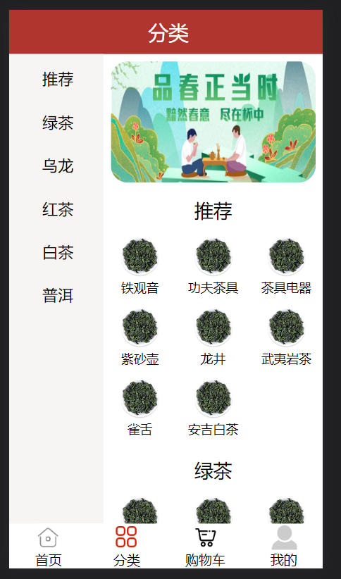
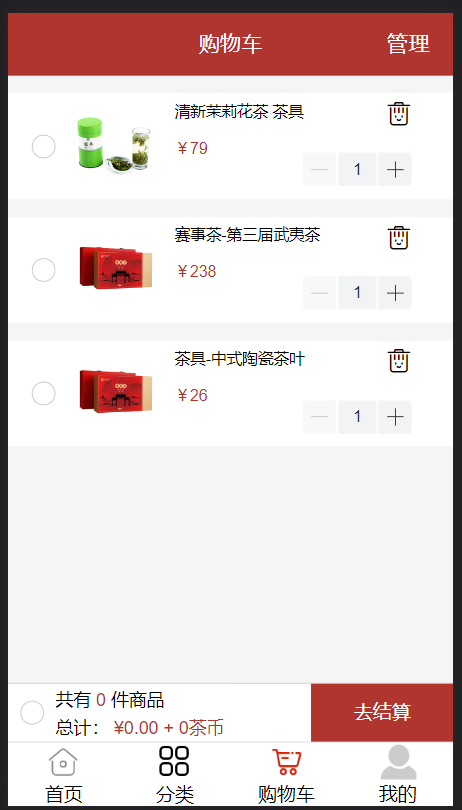
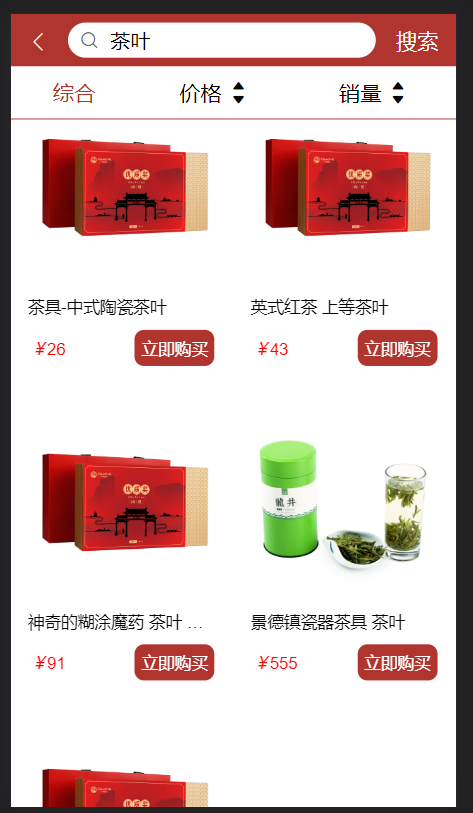

# tea-store
这是一个vue2+node.js仿移动端的电商项目

前端：vue2 + vuex + axios + vant + 图片懒加载 + 路由懒加载 +better-scroll + scss + flexible.js淘宝无限适配

后端：node.js + MySQL + jsonwebtoken（使用express-generator插件搭建服务器）

后端文件夹是server，运行整个项目前要先在本地终端启动sever

数据库文件：tea_store.sql

看个人不同，可以去server->db->sql.js修改连接数据库的配置

# 功能点
1、短信验证码 或 密码登录、注册
    登录、注册时后端都会生成一个token，并存进数据库，
    成功后返回前端用户数据，前端进行vuex和本地存储

2、axios二次封装
    增加请求拦截器和响应拦截器
    请求拦截器：
        判断vuex中有无token，若有则放进heders一起发送给后端
    响应拦截器：
        判断token有没有过期：
            如果过期了后端会返回code：1000的状态码，前端进行提示、自动退出登录并跳转登陆页面
            没有过期，前端返回请求回来的数据中页面渲染只需要的部分

3、路由懒加载、图片懒加载
    提升性能、使用vant组件提供的图片懒加载标签

4、vuex模块化
    项目中有大量需要存储的数据，对其进行模块化分门别类存放并使用
    

5、封装组件复用组件
    轮播图Swiper、顶部Header、底部切换栏Tabbar

6、全局前置路由守卫
    进入购物车、订单类页面、地址类页面需要先进行登录，登陆成功后自动跳转到原来的页面
    登录后，不能再进入登录和注册页面

7、使用的组件库
    vant、mint-ui（使用toast）、iconfont字体图标

8、使用sass css预处理器

9、引入better-scroll滑动插件

    click: true              开启点击事件
    bounce: false       阻止回弹效果
    probeType: 3       允许派发滚动事件

    $nextTick钩子，等页面DOM全部加载完毕再初始化

10、flexible.js淘宝无限适配 + rem 响应式布局

# 项目展示







# 功能模块

1、 Login登录注册

2、 Home首页

3、 Search搜索

4、 Category分类

5、 Detail详情

6、 Cart购物车

7、 Order订单

8、 Address地址

9、 My我的

# 项目启动

```
// 在 TEA-STORE 和 sever 的文件夹目录下分别打开终端，分别下载依赖
npm install
```

### 编译
前后端执行的命令不同，具体可以去各自的package.json文件查看script脚本
```
// TEA-STORE的终端运行
npm run serve

// sever的终端运行
npm run start
```

### 打包项目
```
// TEA-STORE的终端运行
npm run build
```

